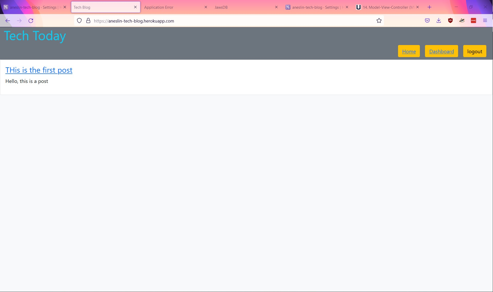

# tech-blog

## Description
A basic blog where a users can post articles and comment responses.  A user may register an account, at which point they can access the dashboard.  From the dashboard they can author new articles.  They can also edit or delete their articles. The dashboard will display all articles they have posted. 

When logged in, they can view individual articles and post comments.  After five minutes of inactivity, a user will be logged out.

## Technologies
* Nodejs
* Sequelize
* Express
* bcrypt

## Features
* A user can see articles and comments
* A user may register a new account
* A user may log in to post new articles and comment on articles
* A user may view a dashboard displaying all the articles they have created

## Future development
* Improvement  to the user interface 

## Deployed app
[Deployed app](https://aneslin-tech-blog.herokuapp.com/)

## Screenshot
